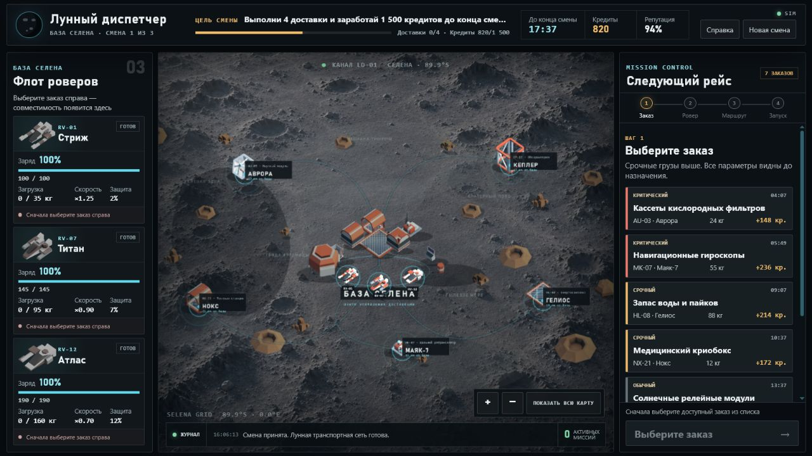
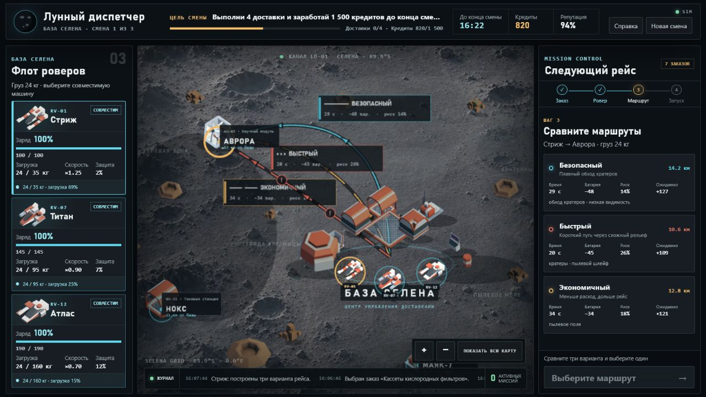
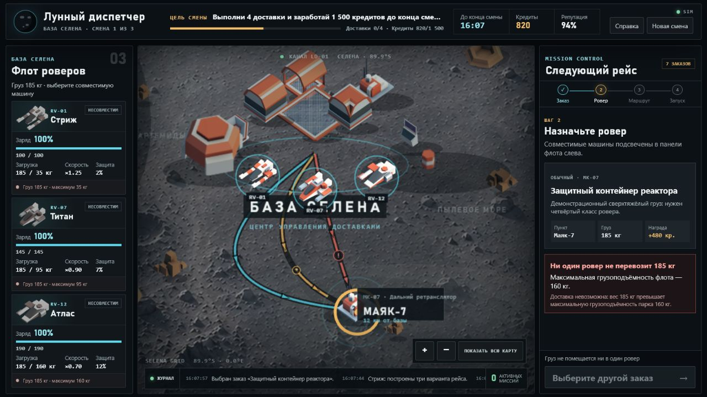
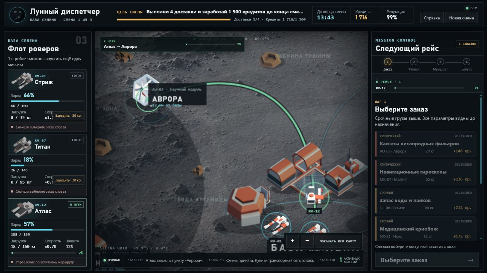
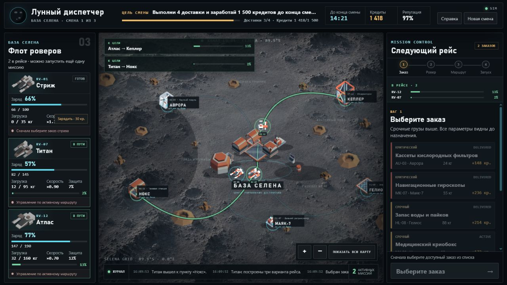
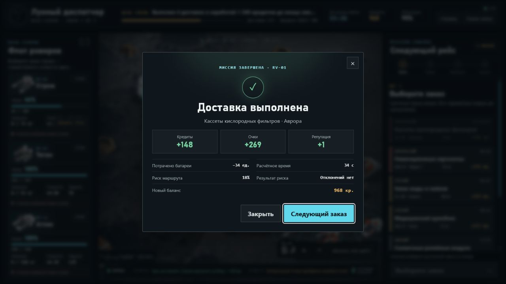

# Moon Courier Crisis

Игровой симулятор лунной доставки. Игрок — диспетчер базы «Селена»: выбирает заказ (вес, награда, срочность, риск), подбирает ровер по грузоподъёмности и батарее, сравнивает маршруты, запускает доставку и следит за деньгами, очками и рейтингом базы три смены подряд.

За игрой стоят два независимых backend-сервиса. **`game-api`** держит игровое состояние (роверы, заказы, доставки) на сервере в SQLite и авторитетно считает каждую доставку — браузер отправляет только намерение («запусти этот ровер по этому маршруту»), а не диктует результат. **Event-pipeline** отдельно от игровой логики принимает и хранит поток игровых событий для аналитики: `Игра → Event API → Redpanda → Event Processor → ClickHouse → Analytics API/дашборд`. Второе — решение сверх минимальных требований задания: любую игру, которую собираются развивать, нужно понимать через метрики (где игроки отказываются от заказа, какой ровер невыгоден, где теряют прогресс), поэтому событийный слой рассчитан на нагрузку сильно больше, чем нужно для демо — очередь сообщений и колоночная БД не упрутся в тысячи событий в секунду, если игра когда-то станет реально онлайн.

## Скриншоты

| | |
|---|---|
|  |  |
|  |  |
|  |  |

## Что сделано

- Карта Луны (Phaser 3): база «Селена», 5 точек назначения, зоны местности, анимация роверов и маршрутов.
- 7 заказов с весом, наградой, срочностью, риском груза и сроком.
- 3 ровера с разной грузоподъёмностью, батареей, скоростью, защитой от риска.
- Выбор заказа → ровера → маршрута → предпросчёт (батарея/время/риск/награда) → запуск.
- Обязательный невозможный сценарий: заказ 185 кг превышает лимит самого мощного ровера (160 кг) — запуск заблокирован с понятным текстом.
- 3 игровые смены, победа при рейтинге > 0 после третьей смены, поражение при рейтинге 0, итоговый экран со статистикой.
- Полный backend-pipeline игровых событий (Event API, Redpanda, Event Processor, ClickHouse) и аналитический дашборд под метрики лунной доставки (доля успеха, риск, эффективность роверов, популярность маршрутов, причины отказа).
- Игра шлёт реальные события в этот pipeline в фоне, best-effort — не блокирует игровой процесс, если backend недоступен.
- Игровой сервер `game-api` (FastAPI + SQLite): роверы/заказы/доставки хранятся и считаются на сервере, а не в браузере — те же правила веса/батареи/риска, что и в mock-режиме, но авторитетные, плюс WebSocket проталкивает обновления состояния клиенту раз в секунду.

**Не сделано (сознательно, за рамками MVP):** `game-api` не проверяет, что запрос действительно пришёл от игрока, которому принадлежит сессия — сессии не привязаны к аккаунту/паролю, потому что в игре нет ни того, ни другого. Достаточно для локального демо, недостаточно для публичного продакшена.

## Архитектура и почему она такая

```
                    ┌─────────────────────────────────────────────────┐
                    │  game-api (FastAPI)  ──►  SQLite                │
Игра (React+Phaser) │  роверы / заказы / доставки, авторитетный       │
    │◄──REST + WS───┤  расчёт каждой доставки                         │
    │               └─────────────────────────────────────────────────┘
    │  игровые события (выбрал заказ, запустил доставку, миссия завершилась...)
    ▼
Event API (FastAPI)  ──►  Redpanda (очередь)  ──►  Event Processor  ──►  ClickHouse  ──►  Analytics API + дашборд
```

**`game-api` — почему игровое состояние переехало на сервер.** В mock-режиме (см. «Как запустить») вся игра честно живёт в браузере: удобно для локальной разработки без Docker, но `localStorage` может редактировать сам игрок — никакой честности в результатах нет. `game-api` — тот же набор правил (`frontend/src/domain/calculations.ts` и его серверная копия `src/game_api/calculations.py`), но выполняется на сервере: браузер присылает только «хочу отправить этот ровер по этому маршруту», а вес/батарею/риск/итог броска считает и проверяет сервер, используя собственный `seed` сессии — подменить исход, играя нечестно на клиенте, нельзя. Состояние лежит в SQLite нормализованными таблицами (`sessions`, `rovers`, `orders`, `deliveries`, `logs`), не одним JSON-блобом, — ровно то «структурированное хранилище», которое просило задание. WebSocket раз в секунду пересчитывает активные доставки (истекла ли батарея, доехал ли ровер, не пора ли новой смене) и проталкивает состояние клиенту — тот же принцип, что и `setInterval`-тикер в mock-режиме, но авторитетный.

Задание просило маленькую игру — её можно было сделать одним frontend-приложением без единого сервера. Но у любой игры, которую собираются развивать и удерживать в ней аудиторию, есть закон, известный любому продуктовому геймдеву: **если не собирать события игроков, невозможно понять, где они теряют интерес и на чём решения о балансе принимаются вслепую**. Поэтому рядом с игрой намеренно построен настоящий, отдельный от игровой логики событийный backend — не потому что того требовало задание, а потому что так делает любой серьёзный игровой проект с первого дня.

**Зачем очередь сообщений (Redpanda), а не запись событий сразу в базу.** Если бы игра писала события прямо в аналитическую БД, всплеск активности (много игроков одновременно) тормозил бы саму игру или ронял события при недоступности базы. Очередь разрывает эту связь: приём события занимает миллисекунды и не зависит от скорости его обработки. Это классический паттерн ingestion-слоя, которым пользуются реальные игровые студии для телеметрии — здесь он воспроизведён в компактном, но полностью рабочем виде, с той же гарантией доставки (at-least-once: событие не теряется, даже если ClickHouse временно недоступен — проверено вручную, гашением базы во время приёма событий).

**Зачем именно ClickHouse, а не обычная реляционная БД.** Аналитические данные — это не то же самое, что игровое состояние: они только накапливаются (append-only), никогда не перезаписываются, и по ним нужно быстро считать агрегаты (сколько доставок успешно, средний риск, эффективность каждого ровера) по миллионам строк сразу. ClickHouse — колоночная СУБД: хранит и читает данные по столбцам, а не по строкам, поэтому такие агрегаты считаются на порядки быстрее, чем в PostgreSQL/MySQL. Цена — ClickHouse плохо подходит для точечных `UPDATE` одной записи, но игровым событиям это и не нужно: они пишутся один раз и не меняются.

**Зачем два разных хранилища, а не одна база.** Текущее состояние игры (заказы, роверы, доставка прямо сейчас) — маленькое, часто меняется и нужно только конкретному игроку. История событий для аналитики — растёт бесконечно и должна агрегироваться сразу по всем игрокам. Смешивать их в одной БД — заведомо плохая архитектура на любом масштабе, поэтому они разделены с первого дня, а не после того, как что-то начало тормозить.

**Зачем Docker Compose.** Проект — это шесть независимых сервисов (игра, игровой сервер, приём событий, очередь, обработчик, БД + аналитика), у каждого свои зависимости и версии. Docker Compose поднимает всё это одной командой одинаково на любой машине, с healthcheck'ами и правильным порядком старта — без него пришлось бы вручную ставить Python, Node, Kafka-совместимый брокер и колоночную БД и следить, чтобы они не конфликтовали по портам.

**Как это сделано технически (ключевые детали).**

- Топик `game-events` — 6 партиций, ключ сообщения = `player_id`. Порядок событий внутри одного игрока сохраняется, при этом обработчиков можно поднять до шести штук параллельно без переразбиения топика.
- Продюсер пишет с `acks=all` — HTTP `202` возвращается только после подтверждения записи брокером, а не «в никуда».
- Обработчик читает пачками (до 500 событий или 2 секунды) и делает один batch-`INSERT` в ClickHouse. Это принципиально: ClickHouse крайне плохо переносит вставку по одной строке, каждая создаёт отдельную part.
- At-least-once обеспечен порядком действий: `enable_auto_commit=False`, оффсет коммитится **после** успешной вставки. Вставка ретраится с экспоненциальным backoff (8 попыток, до 30 с); если ClickHouse так и не поднялся — процесс падает, оффсет остаётся некоммиченным, и после рестарта пачка перечитывается заново.
- Битое сообщение не роняет обработчик и не блокирует партицию: оно логируется и пропускается, остальная пачка пишется.

**Итог:** backend спроектирован так, чтобы не переделывать архитектуру, если игра когда-то станет по-настоящему онлайн — очередь и обработчик масштабируются горизонтально независимо от игры и от БД, что и есть смысл держать их разделёнными уже сейчас.

## Как запустить

### Только игра, без backend (mock-режим)

```bash
cd frontend
npm install
npm run dev
```

Откроется на `http://localhost:5173`. Полностью автономна, игровая логика считается в браузере, ничего больше не нужно.

### Всё вместе: игра на реальном сервере + аналитика

```bash
docker compose up --build
```

Полный стек поднимается в **live**-режиме — фронтенд отправляет ходы на `game-api`, а не считает их сам (переключается флагом `VITE_GAME_API_MODE`, см. `docker-compose.yml`/`frontend/.env.example`).

- Игра — http://localhost:8080 (бейдж `LIVE` в шапке — состояние ведёт сервер)
- Game API (Swagger) — http://localhost:8020/docs
- Аналитика (дашборд) — http://localhost:8001
- Event API (Swagger) — http://localhost:8010/docs
- ClickHouse — http://localhost:8123

### Тесты

```bash
pytest                          # backend: 27 passed, 1 skipped
cd frontend && npm test         # frontend: 17 passed
cd frontend && npm run build    # typecheck + сборка
cd frontend && npm run lint     # eslint --max-warnings 0
```

Пропущенный тест — сквозной `tests/e2e/test_pipeline_e2e.py` (Event API → Redpanda → Processor → ClickHouse на testcontainers), включается через `RUN_E2E=1`.

## Как работает игровая логика

Формулы — чистые функции в [`frontend/src/domain/calculations.ts`](frontend/src/domain/calculations.ts) (mock-режим) и один в один портированные в [`src/game_api/calculations.py`](src/game_api/calculations.py) (live-режим, авторитетно). Результат воспроизводим (детерминированный roll от seed сессии, без `Math.random()`/`random()` в горячем пути).

```text
load_ratio    = вес заказа / грузоподъёмность ровера          → >1 запрещает запуск
energy_cost   = дистанция × расход/км × коэф.маршрута × (1 + 0.65 × load_ratio)
duration      = базовое время × коэф.маршрута × (1 + 0.35 × load_ratio) / скорость ровера
risk          = базовый риск маршрута + риск груза + 0.12 × load_ratio − защита ровера
```

Запуск запрещён, если: вес больше лимита ровера, батареи не хватит с учётом резерва 5 ед., ровер или заказ уже заняты, маршрут ведёт не туда. При успехе — начисляется награда, растут очки и рейтинг; при провале — списывается штраф, падает рейтинг; в обоих случаях тратится батарея. Рейтинг 0 или конец 3-й смены — конец игры.

## Где хранятся данные

| Данные | Где |
|---|---|
| Текущая игра (live-режим, `docker compose up`): заказы, роверы, доставки, кредиты, рейтинг, журнал | SQLite в `game-api`, таблицы `sessions`/`rovers`/`orders`/`deliveries`/`logs` |
| Текущая игра (mock-режим, `npm run dev` без backend) | `localStorage` браузера, переживает обновление страницы |
| История всех игровых событий (для аналитики, оба режима) | ClickHouse, таблица `game_events` |
| Карта, роверы, каталог заказов | конфигурация в коде — дублируется в `frontend/src/data/` (mock) и `src/game_api/` (live), см. «Известные ограничения» |

Игровое состояние и аналитика — сознательно разные хранилища: первое часто перезаписывается и нужно только на игрока, второе только растёт и должно быстро агрегироваться по всем игрокам сразу — для этого и нужна отдельная колоночная СУБД (ClickHouse), а не обычная реляционная база.

## Что использовано из AI
ChatGpt, codex, claud

## Известные ограничения

- В mock-режиме (`npm run dev` без backend) игровая логика по-прежнему считается в браузере — нет защиты от подмены состояния в `localStorage`. В live-режиме (`docker compose up`) это уже не так: считает и проверяет сервер.
- Карта, каталог заказов и формулы существуют в двух копиях — TypeScript (`frontend/src/`) для mock-режима и Python (`src/game_api/`) для live — по замыслу (mock должен работать без единого сервера), но это ручная синхронизация: если поменять цифры в одном месте и забыть про другое, режимы разойдутся. Ничего не проверяет это автоматически.
- `game-api` не аутентифицирует сессии (см. «Не сделано») и включает CORS `allow_origins=["*"]` — осознанно для локального демо, не для публичного развёртывания.
- `game-api` открывает новое SQLite-соединение на каждый вызов; для одиночного игрока это не проблема, но при реальной многопользовательской нагрузке потребуется пул соединений или переход на клиент-серверную БД.
- Формулы наград и зарядки батареи упрощены до одного уровня, без бонусов за срочность.
- Синтетический генератор нагрузки backend (`event-generator`) шлёт тестовые события отдельного формата — не влияет на игру и аналитику по ней.
- **At-least-once без дедупликации.** Гарантия «событие не теряется» оплачивается тем, что оно может задвоиться (ретрай продюсера, перечитывание пачки после падения). Таблица — обычный `MergeTree`, дублей по `event_id` она не схлопывает, поэтому счётчики в дашборде — верхняя оценка. Готовое место под это уже есть: `ORDER BY` заканчивается на `event_id`, так что переход на `ReplacingMergeTree` — правка одной строки в схеме.
- Клиентская очередь телеметрии в `localStorage` накапливает события, если backend недоступен, но не досылает их при восстановлении связи — такие события в ClickHouse не попадут.
- Event API открыт без аутентификации и rate limit: любой может залить произвольные события. Для демо это осознанно, для продакшена нужен ключ приложения.
