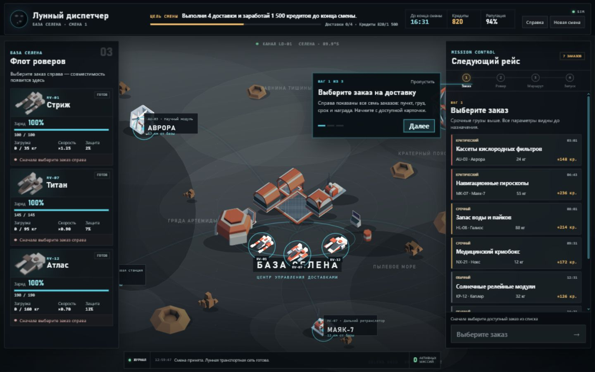
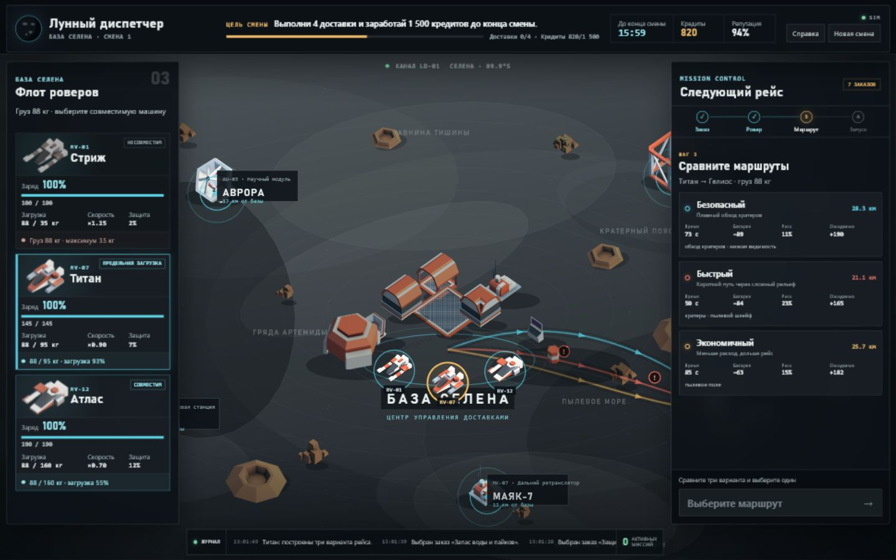
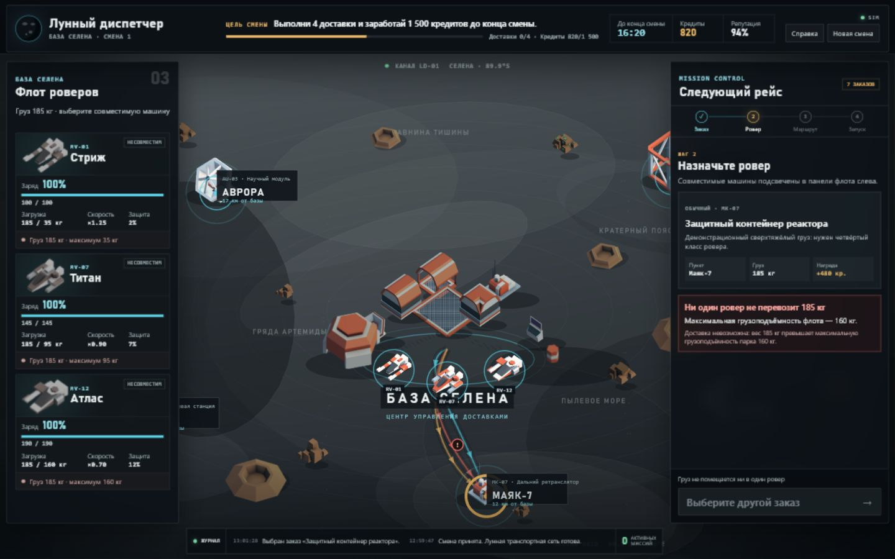
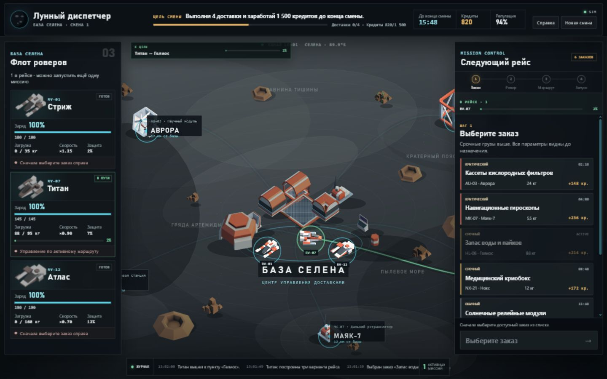
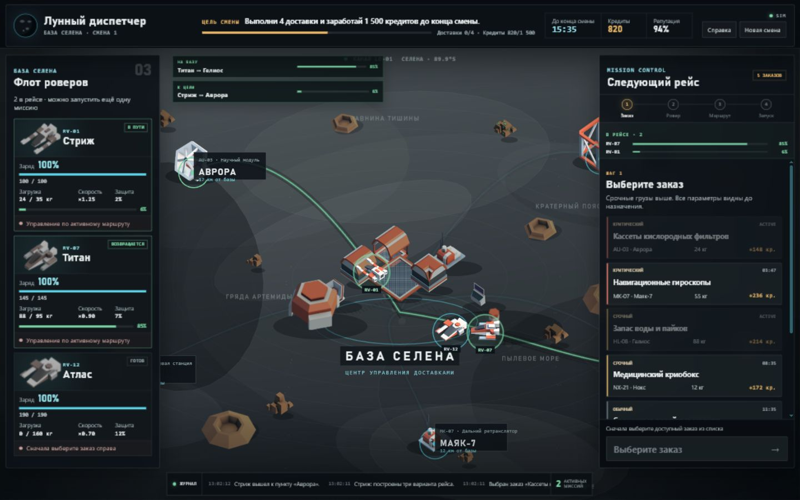
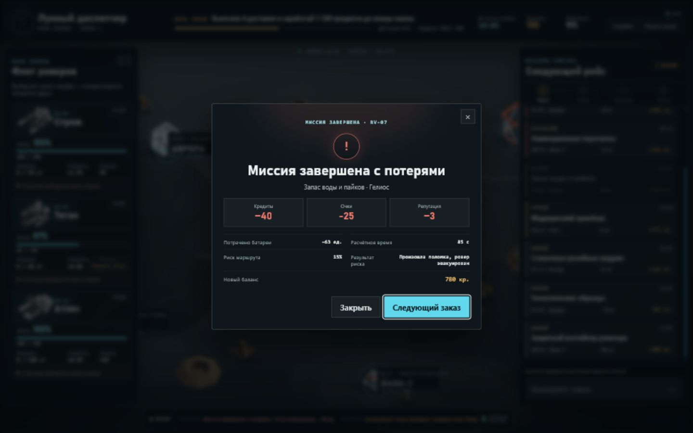

# Lunar Dispatch: Смена на Селене

Игровой симулятор лунной доставки. Игрок — диспетчер базы «Селена»: выбирает заказ (вес, награда, срочность, риск), подбирает ровер по грузоподъёмности и батарее, сравнивает маршруты, запускает доставку и следит за деньгами, очками и рейтингом базы три смены подряд.

Рядом с игрой — свой backend, который принимает игровые события в реальном времени и хранит их для аналитики: `Игра → Event API → Redpanda → Event Processor → ClickHouse → Analytics API/дашборд`. Это решение сверх минимальных требований задания: любую игру, которую собираются развивать, нужно понимать через метрики (где игроки отказываются от заказа, какой ровер невыгоден, где теряют прогресс), поэтому событийный слой сделан отдельно от игровой логики и рассчитан на нагрузку сильно больше, чем нужно для демо — очередь сообщений и колоночная БД не упрутся в тысячи событий в секунду, если игра когда-то станет реально онлайн.

## Скриншоты

| | |
|---|---|
|  |  |
|  |  |
|  |  |

## Что сделано

- Карта Луны (Phaser 3): база «Селена», 5 точек назначения, зоны местности, анимация роверов и маршрутов.
- 7 заказов с весом, наградой, срочностью, риском груза и сроком.
- 3 ровера с разной грузоподъёмностью, батареей, скоростью, защитой от риска.
- Выбор заказа → ровера → маршрута → предпросчёт (батарея/время/риск/награда) → запуск.
- Обязательный невозможный сценарий: заказ 185 кг превышает лимит самого мощного ровера (160 кг) — запуск заблокирован с понятным текстом.
- 3 игровые смены, победа при рейтинге > 0 после третьей смены, поражение при рейтинге 0, итоговый экран со статистикой.
- Полный backend-pipeline игровых событий (Event API, Redpanda, Event Processor, ClickHouse) и аналитический дашборд под метрики лунной доставки (доля успеха, риск, эффективность роверов, популярность маршрутов, причины отказа).
- Игра шлёт реальные события в этот pipeline в фоне, best-effort — не блокирует игровой процесс, если backend недоступен.

**Не сделано (сознательно, за рамками MVP):** отдельный игровой сервер (`game-api`) и серверная БД состояния (SQLite) — вся игровая логика сейчас честно живёт в браузере (mock-режим), это не скрыто и объяснено ниже.

## Архитектура и почему она такая

```
Игра (React + Phaser)
    │  игровые события (выбрал заказ, запустил доставку, миссия завершилась...)
    ▼
Event API (FastAPI)  ──►  Redpanda (очередь)  ──►  Event Processor  ──►  ClickHouse  ──►  Analytics API + дашборд
```

Задание просило маленькую игру — её можно было сделать одним frontend-приложением без единого сервера. Но у любой игры, которую собираются развивать и удерживать в ней аудиторию, есть закон, известный любому продуктовому геймдеву: **если не собирать события игроков, невозможно понять, где они теряют интерес и на чём решения о балансе принимаются вслепую**. Поэтому рядом с игрой намеренно построен настоящий, отдельный от игровой логики событийный backend — не потому что того требовало задание, а потому что так делает любой серьёзный игровой проект с первого дня.

**Зачем очередь сообщений (Redpanda), а не запись событий сразу в базу.** Если бы игра писала события прямо в аналитическую БД, всплеск активности (много игроков одновременно) тормозил бы саму игру или ронял события при недоступности базы. Очередь разрывает эту связь: приём события занимает миллисекунды и не зависит от скорости его обработки. Это классический паттерн ingestion-слоя, которым пользуются реальные игровые студии для телеметрии — здесь он воспроизведён в компактном, но полностью рабочем виде, с той же гарантией доставки (at-least-once: событие не теряется, даже если ClickHouse временно недоступен — проверено вручную, гашением базы во время приёма событий).

**Зачем именно ClickHouse, а не обычная реляционная БД.** Аналитические данные — это не то же самое, что игровое состояние: они только накапливаются (append-only), никогда не перезаписываются, и по ним нужно быстро считать агрегаты (сколько доставок успешно, средний риск, эффективность каждого ровера) по миллионам строк сразу. ClickHouse — колоночная СУБД: хранит и читает данные по столбцам, а не по строкам, поэтому такие агрегаты считаются на порядки быстрее, чем в PostgreSQL/MySQL. Цена — ClickHouse плохо подходит для точечных `UPDATE` одной записи, но игровым событиям это и не нужно: они пишутся один раз и не меняются.

**Зачем два разных хранилища, а не одна база.** Текущее состояние игры (заказы, роверы, доставка прямо сейчас) — маленькое, часто меняется и нужно только конкретному игроку. История событий для аналитики — растёт бесконечно и должна агрегироваться сразу по всем игрокам. Смешивать их в одной БД — заведомо плохая архитектура на любом масштабе, поэтому они разделены с первого дня, а не после того, как что-то начало тормозить.

**Зачем Docker Compose.** Проект — это пять независимых сервисов (игра, приём событий, очередь, обработчик, БД + аналитика), у каждого свои зависимости и версии. Docker Compose поднимает всё это одной командой одинаково на любой машине, с healthcheck'ами и правильным порядком старта — без него пришлось бы вручную ставить Python, Node, Kafka-совместимый брокер и колоночную БД и следить, чтобы они не конфликтовали по портам.

**Итог:** backend спроектирован так, чтобы не переделывать архитектуру, если игра когда-то станет по-настоящему онлайн — очередь и обработчик масштабируются горизонтально независимо от игры и от БД, что и есть смысл держать их разделёнными уже сейчас.

## Как запустить

### Только игра (без backend)

```bash
cd frontend
npm install
npm run dev
```

Откроется на `http://localhost:5173`. Полностью автономна, ничего больше не нужно.

### Всё вместе (игра + backend + аналитика)

```bash
docker compose up --build
```

- Игра — http://localhost:8080
- Аналитика (дашборд) — http://localhost:8001
- Event API (Swagger) — http://localhost:8010/docs
- ClickHouse — http://localhost:8123

### Тесты

```bash
pytest                          # backend: 16 passed, 1 skipped
cd frontend && npm test         # frontend: 17 passed
cd frontend && npm run build    # typecheck + lint + сборка — чисто
```

## Как работает игровая логика

Формулы — чистые функции в [`frontend/src/domain/calculations.ts`](frontend/src/domain/calculations.ts), результат воспроизводим (детерминированный roll от seed сессии, без `Math.random()`).

```text
load_ratio    = вес заказа / грузоподъёмность ровера          → >1 запрещает запуск
energy_cost   = дистанция × расход/км × коэф.маршрута × (1 + 0.65 × load_ratio)
duration      = базовое время × коэф.маршрута × (1 + 0.35 × load_ratio) / скорость ровера
risk          = базовый риск маршрута + риск груза + 0.12 × load_ratio − защита ровера
```

Запуск запрещён, если: вес больше лимита ровера, батареи не хватит с учётом резерва 5 ед., ровер или заказ уже заняты, маршрут ведёт не туда. При успехе — начисляется награда, растут очки и рейтинг; при провале — списывается штраф, падает рейтинг; в обоих случаях тратится батарея. Рейтинг 0 или конец 3-й смены — конец игры.

## Где хранятся данные

| Данные | Где |
|---|---|
| Текущая игра: заказы, роверы, доставки, кредиты, рейтинг | `localStorage` браузера, переживает обновление страницы |
| История всех игровых событий (для аналитики) | ClickHouse, таблица `game_events` |
| Карта, роверы, каталог заказов | конфигурация в коде фронтенда (`frontend/src/data/`) |

Игровое состояние и аналитика — сознательно разные хранилища: первое часто перезаписывается и нужно только на игрока, второе только растёт и должно быстро агрегироваться по всем игрокам сразу — для этого и нужна отдельная колоночная СУБД (ClickHouse), а не обычная реляционная база.

## Что использовано из AI

_(дополнить)_

## Известные ограничения

- Игровая логика считается в браузере (mock), не на сервере — нет защиты от подмены состояния в `localStorage`.
- Формулы наград и зарядки батареи упрощены до одного уровня, без бонусов за срочность.
- Синтетический генератор нагрузки backend (`event-generator`) шлёт тестовые события отдельного формата — не влияет на игру и аналитику по ней.
